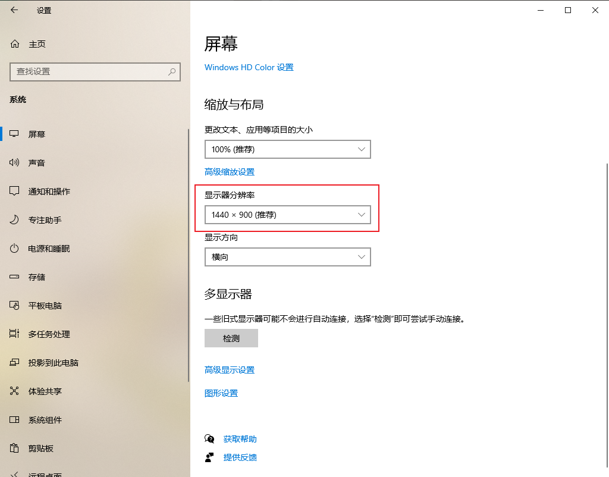

# 电脑死机的处理

> 电脑圈至理名言：  
> 重启可以解决90%的问题，  
> 重装可以解决99%的问题，  
> 重买可以解决100%的问题。

通常情况下，电脑会由于某些因素造成系统崩溃，导致无法进行任何操作，进而造成死机。

## 运行内存不足导致的死机

**现象**：打开新的程序或网页时，出现提示内存不足的弹窗，浏览器则会在新打开的页面上提示文字信息。此时可能会出现严重的卡顿和乱码，甚至造成死机

**原因**：电脑上运行的程序太多或者打开的网页太多

**解决**：关闭一些不必要的程序或网页，如果仍然非常卡顿，建议重启，如果电脑已经死机，没有任何反应，建议从电脑底部电源键进行重启。

## 打开PPT造成的死机

**现象**：打开PPT后，点击电脑屏幕没有任何反应

**原因**：不明

**解决**：首先尝试长按PPT界面，如果可以弹出菜单，则点击菜单中的“结束放映”，否则建议直接从底部电源键重启

## 分辨率变化造成的死机

**现象**：电脑首先黑屏，然后变清晰（实际上是分辨率变了）

**原因**：因为分辨率变高了，电脑要处理的数据变多，处理不过来就会变卡甚至死机

**解决**：有两种办法

1. 回到电脑桌面，长按桌面任意位置，弹出菜单后点击“显示设置”，设置界面打开后点击“显示器分辨率”以调整分辨率，这样可以让电脑运行地稍微快一点，但是仍然会比较卡，适用于课堂时间紧张、没时间重启的情况
2. 如果时间充裕，建议直接通过电脑的开始菜单重启

如有其他情况，建议直接重启，并请各位师生和同学补充。