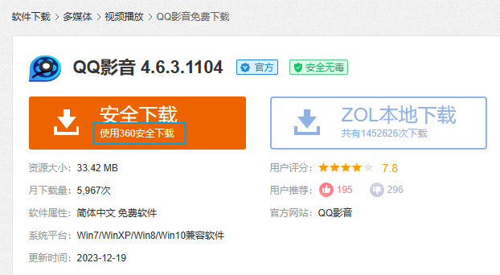
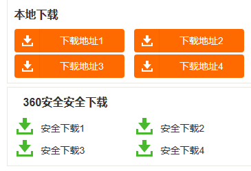

# 维护系统安全

## 防止电脑中毒

**温馨提示**：只要你没有下载**来历不明**的软件，电脑一般就不会中毒！

### 高速下载按钮陷阱

在搜索引擎（如百度）上随意搜索一个软件，以QQ影音为例，大概率会出现诸如XX下载站之类的网站，点进去后可以发现一般有“高速下载（安全下载）”和“普通下载（本地下载）”两种按钮。请注意下图的安全下载按钮下方的小字“使用360安全下载”，它的意思是，先下载360安全卫士，然后再通过360安全卫士里的软件管家下载QQ影音，也就是说，如果点这个按钮下载QQ影音的话，还会给电脑“附赠”一个360安全卫士，但显然我们需要的只是QQ影音，并不需要360，所以请不要点击这种按钮。

高速下载也与此类似。所谓的高速下载，其实是下载了一个名为“高速下载器”的广告程序，不仅不会帮你安装QQ影音，相反，它还为自动为你的电脑安装一些广告满天飞的流氓软件，如XX壁纸、传奇等等，甚至包含一些恶意的病毒软件，被骗的次数多了，电脑上的广告和流氓软件也越来越多，极易造成系统的卡顿和中毒。

所以，在这种网站下载软件时，**无论何时**都请点击普通下载或本地下载！点击之后，网页一般会下滑，接着出现如下图所示的下载按钮，请务必点击“本地下载”一栏的下载地址进行下载，下方的“360安全下载”也是个陷阱，请不要上当。此外，有时候本地下载一栏会显示“浙江电信”“浙江联通”“北京电信”“北京联通”之类的字样，这些按钮前面的省份其实是指服务器所在省份，服务器与你的远近会影响下载速度，但是这些省份都在中国，所以下载速度区别不大，任意点击一个进行下载即可。

### 杀毒软件的选择

如果你坚定地认为安装一个杀毒软件会使电脑更安全的话，那我会建议你不要选择360安全卫士、金山毒霸、2345安全卫士、腾讯电脑管家之类的杀毒软件，因为它们在安装到电脑上后一般都附带广告，有的还会经常高强度扫描电脑硬盘，造成系统卡顿。

什么？你说你想要清理内存的加速球？我可以告诉你，这东西其实并不能有效的清理电脑内存，只能起到安慰作用。

我推荐使用[火绒安全软件](https://www.huorong.cn/person5.html)，简洁轻量干净无广告，不会附带软件管家，也不会经常扫盘，挂在后台的时候基本也没有什么动静，不会打扰你上课、工作、学习，在电脑安装流氓软件时会自动阻止，用了的都说好！