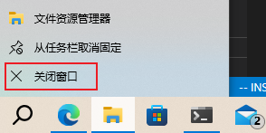

# 运行内存不足的处理

运行内存不足的话，运行过多的程序就会造成卡顿现象，建议在电脑卡顿时及时清理后台程序。清理后台程序主要有两种办法

## 在桌面清理后台

请观察电脑右下角的状态栏，那里会显示正在运行的后台程序，如果程序过多，则会被归在一个小箭头里，点击小箭头可以展开所有正在运行的后台程序，长按这些程序的小图标以弹出菜单，然后点击“退出按钮”即可，有一些当前正在运行的程序不会在状态栏显示，可以直接长按或向上滑电脑底部任务栏的程序图标，然后“点击”关闭窗口以清理程序。

## 用任务管理器清理后台

长按任务栏空白处，弹出菜单后点击“任务管理器”。任务管理器可以看到所有正在运行的程序和后台程序，点击选中一个程序后，再点击右下角的“结束任务”就可以关闭应用。

**不建议一直把任务管理器开着，因为任务管理器也会占用较多的系统资源。**