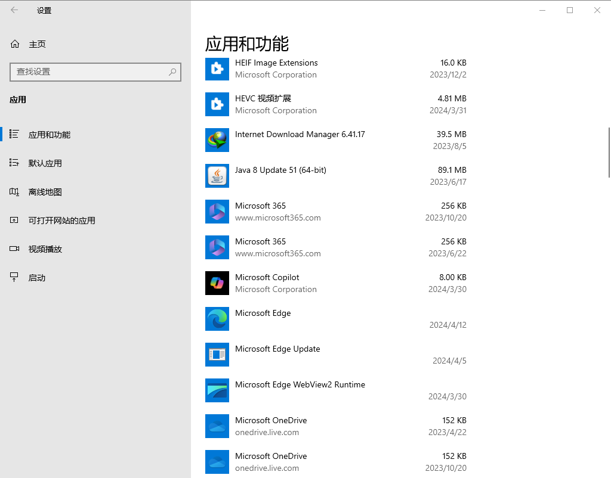

# 卸载软件

卸载一些电脑上不常使用的软件和流氓软件有助于节省电脑的硬盘空间，提高电脑的性能。

## 系统原生的卸载软件入口

1. 打开开始菜单
2. 长按要卸载的应用
3. 弹出菜单后点击“卸载”

执行以上步骤后通常会打开控制面板的【程序和功能】界面，如下图所示

双击要卸载的软件，或者单击一个要卸载的软件，然后点击上面的“卸载”按钮即可开始卸载。当然，这只是卸载软件最直观的入口，你也可以打开控制面板，然后定会到里面的【程序和功能】界面。

「设置」应用也有一个程序卸载的入口：「打开设置应用」> 「应用」 > 「应用和功能」。按这个次序操作即可进入软件管理页面，如下图所示，单击一个软件即可进行卸载。

也可以直接在任务栏上搜索「应用和功能」来进入该界面。

## 辅助卸载软件

辅助卸载软件可用于批量卸载软件和清除软件残留文件，推荐使用 [Geek Uninstaller](https://geekuninstaller.com/)。官网是英文的，但安装完软件后可以设置成中文。