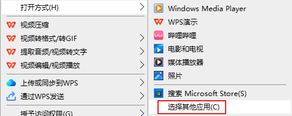

# 播放视频和音频

一般电脑上已经预装了一些视频播放软件，可按需选择。

## 打开视频后提示“不支持解码”？

**原因**：使用了Windows10自带的“视频”应用作为播放视频的默认应用，该应用支持的视频格式少，有些格式还要收费才能支持

**解决**：长按要播放的视频，弹出菜单后选择“打开方式”，然后点击其他的视频播放应用，如果没有，请继续点击该菜单中的“选择其他应用”。

## 设置默认的视频和音频播放应用

点击任务栏的搜索按钮，搜索“默认应用”，然后在设置就界面中设置“视频播放器”和“音乐播放器”即可。

音频无法播放的解决方法同上。