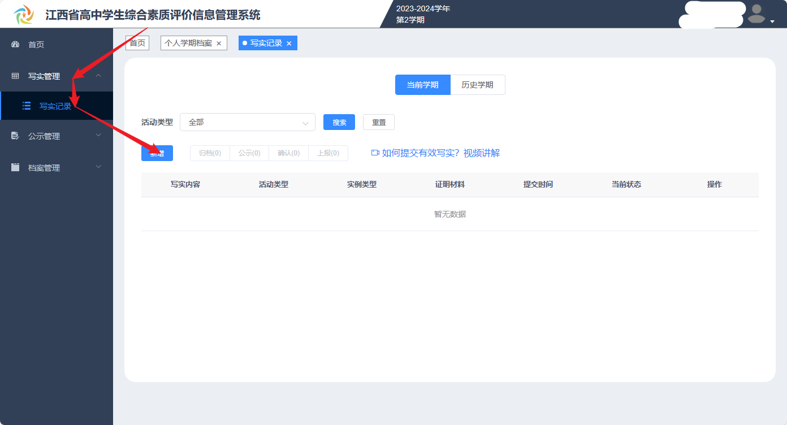
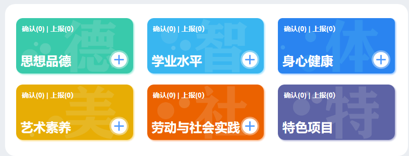
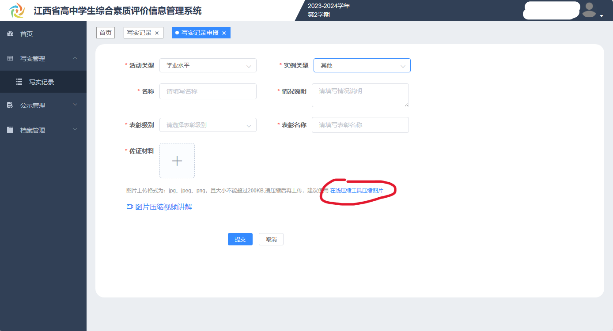
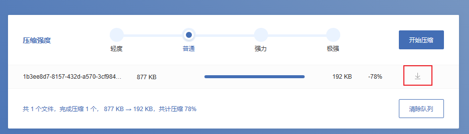
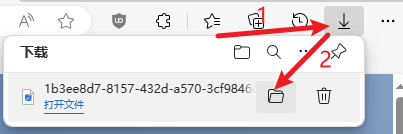
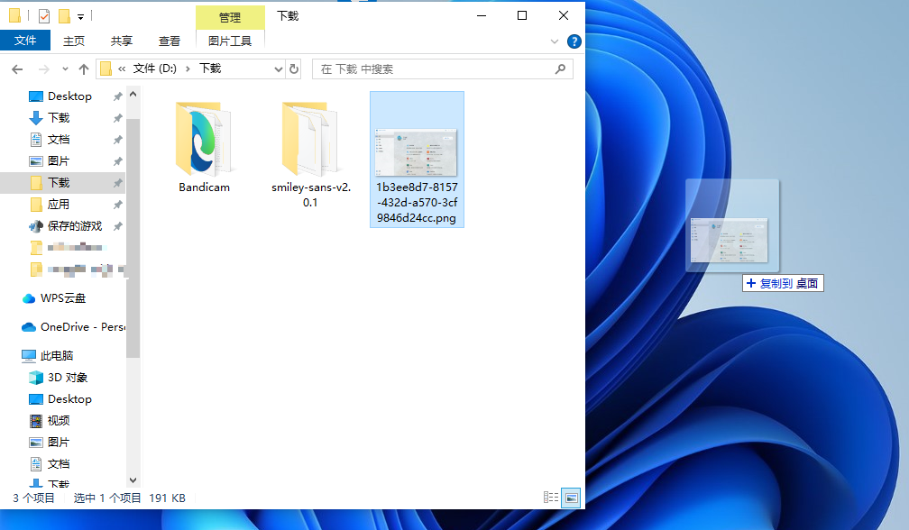
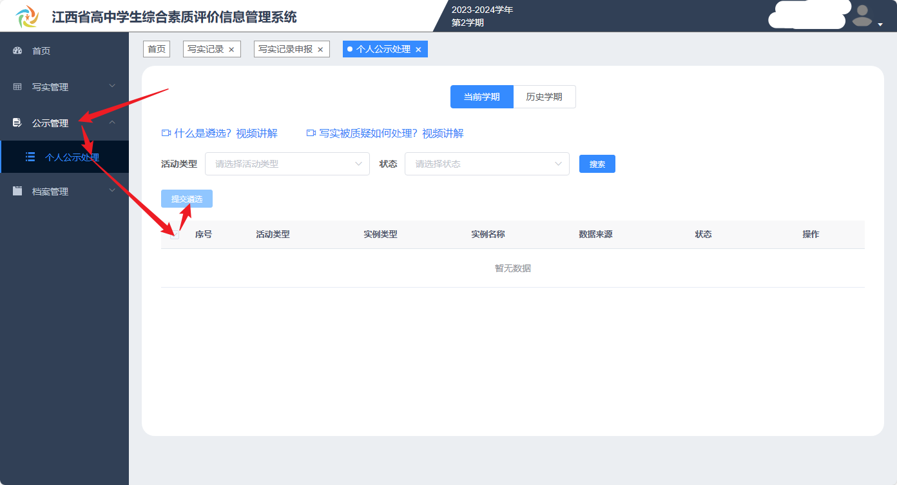

# 综合素质评价的填写

以江西省高中生综合素质评价（以下简称综素评价）为例，江西省初中生综合素质评价的填写与之相同。

- 江西省高中综素评价：https://gzzs.jxedu.gov.cn/
- 江西省初中综素评价：https://czzs.jxedu.gov.cn/

综素评价的填写分为两个板块：写实公示和自评填写

## 写实公示

写实公示有以下4个步骤

1. 自己手动提交写实（可以通俗地理解为上传奖状）
2. 由班主任确认你提交的写实
3. 自己手动遴选已确认的写实
4. 系统自动公示已遴选的写实

需要学生自己参与的为第1步和第3步。不少同学提交写实时，往往只完成了第1步，就以为自己已经提交完了写实，而忽略了遴选的部分。

### 提交写实

打开综素评价的官网后，可以看到如图所示的不同类型写实，点击上面的加号来新增一个写实。也可以点击左侧导航栏的【写实管理】一栏，再点击【写实记录】，然后点击【新增】按钮来提交写实。

各类奖项的对应的写实类型如下：

- 优秀志愿者 ➡️ 思想品德
- 考试成绩、学科竞赛 ➡️ 学业水平
- 体育竞赛、运动会奖项 ➡️ 身心健康
- 美术、音乐奖项、歌唱比赛奖项 ➡️ 艺术素养
- 研学旅行奖项 ➡️ 劳动与社会实践

不过，也不用太过在意写实的类型，这其实没有多大影响。

新增写实后，接下来填写写实的详细信息，根据奖状上的内容来填写即可，这里就不过多赘述了。

需要特别注意【佐证材料】一栏，这里需要上传能够证明你的写实的图片（如奖状）。上传的图片大小不能超过200KB，现在手机拍摄的图片体积普遍较大，因此需要压缩，但是综素评价提供的压缩工具网站已经失效了（上图红圈圈出部分）。

请使用下面的在线图片压缩工具：

- docsmall: https://docsmall.com/image-compress

选择压缩强度，压缩完成后点击右侧的按钮下载

下载完成后打开其所在文件夹。可以拖到桌面方便待会上传。

然后点击【佐证材料】一栏的加号，再选择图片上传，最后点击底部的【提交】按钮即可。

### 遴选写实

待班主任确认写实后，可以开始手动遴选，遴选的步骤相对简单很多。下图展示的是遴选全部写实的步骤，也可以手动勾选部分奖状，来遴选部分写实。

至此，写实公示中需要自己手动操作的部分已经全部完成，综素系统会在遴选时间结束后自动进行公示。

## 自评填写

自评填写一般在学期末进行，步骤比较少，如下

1. 手动填写并写入个人学期档案自评
2. 班主任填写并写入评语
3. 综素系统自动生成档案

需要学生自己参与的仅为第1步。

点击综素系统导航栏左侧的【档案管理】，再点击【个人学期档案】，然后点击左侧待填写自评的档案，填写完内容后，点击下方的【写入】按钮即可。

**请务必点击【写入】按钮！请务必点击【写入】按钮！请务必点击【写入】按钮！**